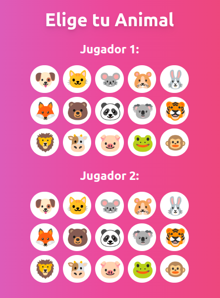

# 🔗📚 Juego de Cadena de Palabras


<div align="center">
  
  
</div>
Un juego interactivo de cadena de palabras construido con React. Desafía a un amigo a una batalla lingüística donde cada palabra comienza con la última letra de la palabra anterior.

## 🎮 ¡Juega ahora!
¡Haz clic [aquí](https://maxiyommi.github.io/WordChainGame/) para jugar al Juego de Cadena de Palabras!

## 🌟 Características

- 👥 Modo multijugador para 2 jugadores.
- 🌓 Cambio dinámico entre modo claro y oscuro.
- 🐵 Selección de avatar con emojis de animales.
- ⏱️ Temporizador para cada turno.
- 🎉 Animaciones divertidas y confeti para el ganador.
- 📊 Sistema de puntuación en tiempo real.

## 🚀 Instalación

1. Clona este repositorio:
   ```
   git clone https://github.com/maxiyommi/word-chain-game.git
   ```
2. Navega al directorio del proyecto:
   ```
   cd word-chain-game
   ```
3. Instala las dependencias:
   ```
   npm install
   ```

## 🎮 Cómo jugar

1. Inicia la aplicación:
   ```
   npm start
   ```
2. Abre tu navegador y ve a `http://localhost:3000`.
3. Cada jugador selecciona un avatar de emoji animal.
4. El primer jugador escribe una palabra.
5. El segundo jugador debe escribir una palabra que comience con la última letra de la palabra anterior.
6. ¡Continúa así hasta que alguien gane!.

## 🛠️ Tecnologías utilizadas

- [React](https://reactjs.org/): fue elegido como el framework principal por su eficiencia en la creación de interfaces de usuario interactivas y su gran ecosistema de herramientas y bibliotecas.
- [Tailwind CSS](https://tailwindcss.com/): fue seleccionado como framework de CSS por su enfoque de "utility-first", que permite un desarrollo rápido y personalizable de la interfaz de usuario.
- [Lucide React](https://lucide.dev/): fue elegida para los iconos por su amplia variedad de iconos modernos y su fácil integración con React.

## 🤝 Cómo contribuir

Las contribuciones son siempre bienvenidas. Aquí hay algunas formas en las que puedes contribuir:

1. 🐛 Reportar bugs.
2. 💡 Sugerir nuevas características.
3. 🔧 Enviar pull requests con mejoras o correcciones.

``` bash
npm run deploy
```


## 📜 Licencia

Este proyecto está bajo la [Licencia MIT](https://mit-license.org/). 

---
> ¡Disfruta jugando y mejorando tu vocabulario con el Juego de Cadena de Palabras! 🎉🧠